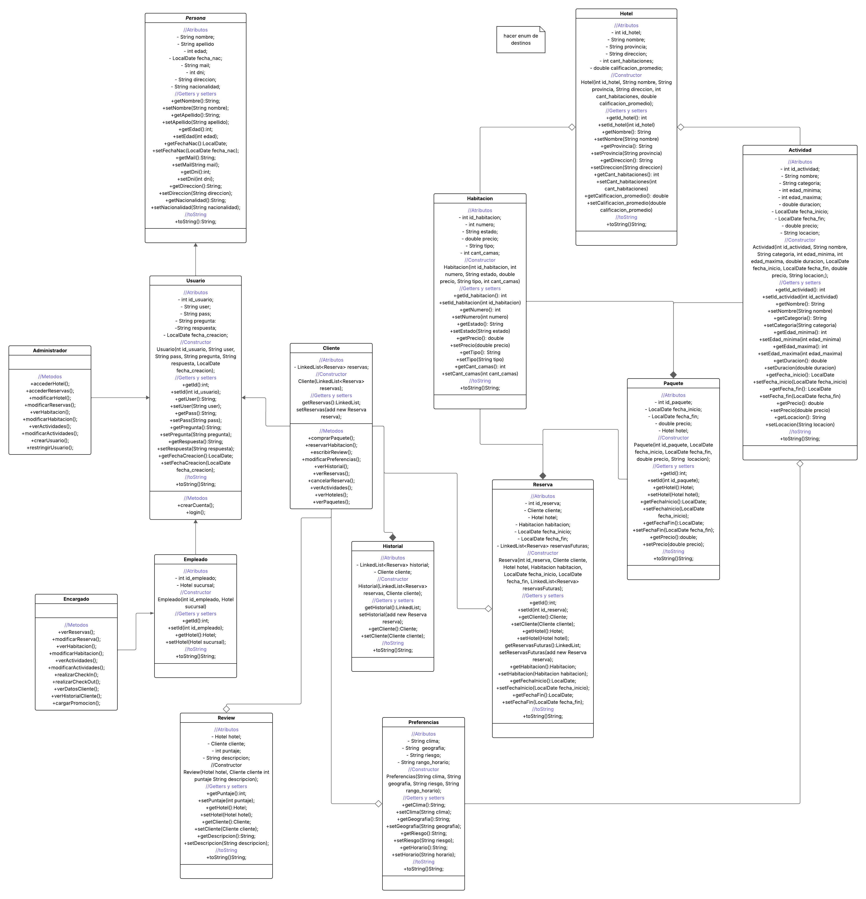
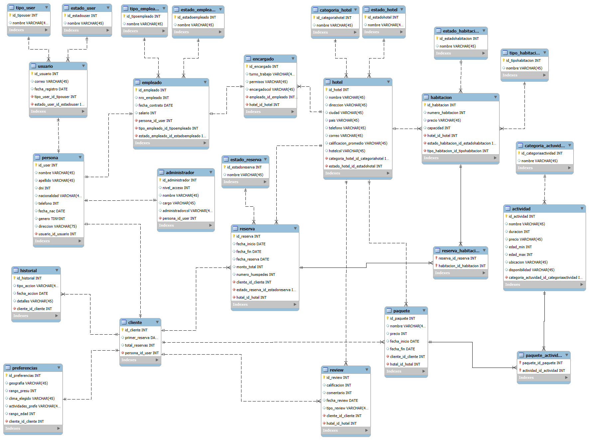

# 🏢 Sistema de administración hotelera 

Alumnos: Victoria Cossi Mazza, Caterina Marquez y Nicolas Nevach.

Trabajo práctico cuatrimestral de la materia Programación Avanzada. Tercer cuatrimestre.

---

## Diagrama de clases

---

## Diagrama de casos de uso

---

## Diagrama DER

---

